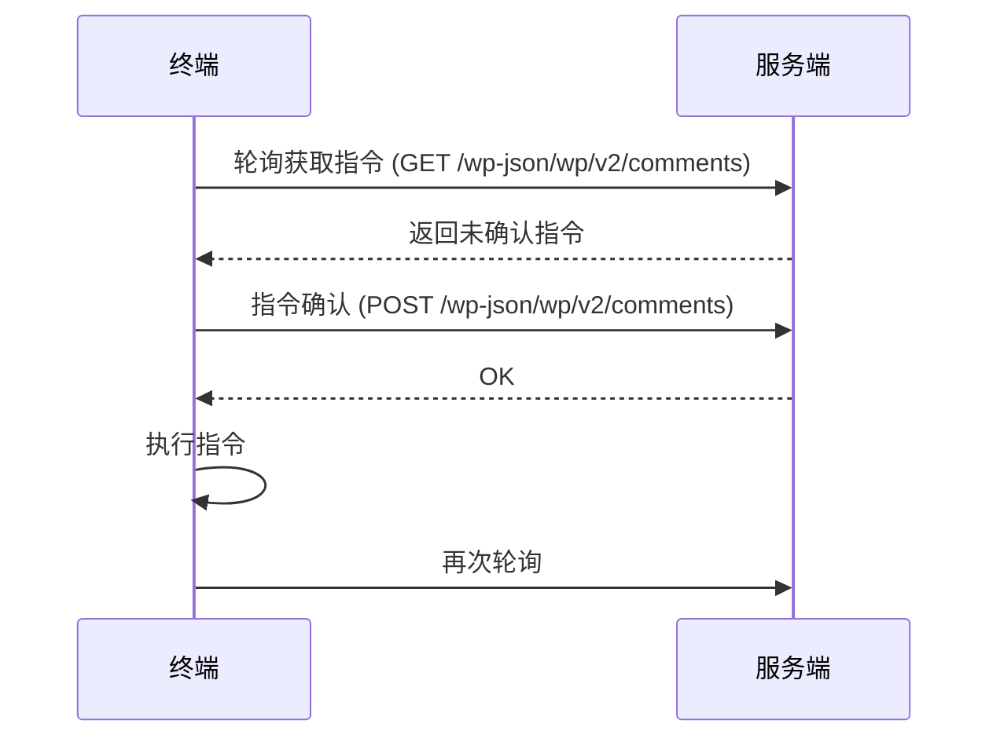

# 指令API（后端开发规范版）

## 1. 指令数据结构

| 字段名         | 类型      | 必须 | 说明                         | 前端字段名（@JsonProperty） |
|----------------|-----------|------|------------------------------|-----------------------------|
| id             | Long      | 否   | 指令唯一ID，自增             | id                          |
| terminalId     | Long      | 是   | 终端ID                       | post                        |
| actMethod      | Integer   | 是   | 执行方式 0-get,1-post,2-put,3-delete | metadata.act_method         |
| authorUrl      | String    | 是   | 指令类型，如api/brightness   | metadata.act_url            |
| content        | String    | 是   | 指令内容（JSON字符串）       | content                     |
| raw            | String    | 否   | 原始指令内容（JSON字符串）   | raw                         |
| meta           | String    | 否   | 元数据（JSON字符串）         | metadata                    |
| createdAt      | Timestamp | 否   | 创建时间                     | created_at                  |

> 说明：前端字段为死字段，后端通过 @JsonProperty 注解自动映射，无需前端配合。

---

### 对应实现文件

- **前端字段定义**：frontend/docs/frontend_api_reference.md
- **后端实体**：backend/src/main/java/com/cloudcontrol/entity/command/Command.java
- **后端DTO**：backend/src/main/java/com/cloudcontrol/dto/command/
- **Repository**：backend/src/main/java/com/cloudcontrol/repository/command/CommandRepository.java
- **数据库迁移脚本**：backend/src/main/resources/db/migration/V4__create_commands.sql
- **集成测试**：backend/src/test/java/com/cloudcontrol/repository/command/CommandRepositoryTest.java
- **ER设计文档**：docs/database/cloud_platform_er_design.md

---

### 后续设计与待实现

- **指令类型枚举与工厂模式**：
  - 计划通过枚举（Enum）统一管理所有指令类型，结合指令工厂类（CommandFactory），实现指令对象的自动创建与分发，便于扩展和维护。
- **Service/Controller 层**：
  - 目前仅实现了基础的实体、DTO、Repository，后续需补充 Command 相关的 Service 层业务逻辑与 Controller 层接口，支持指令下发、查询、状态管理等完整链路。

> 以上为后续优化方向，具体实现可参考架构文档及团队约定。

---

### 前端指令JSON示例

#### 唤醒指令
```json
{
  "post": 1,
  "metadata": {
    "act_url": "api/action",
    "act_method": 1
  },
  "content": "{\"command\":\"wakeup\"}"
}
```

#### 亮度指令
```json
{
  "post": 1,
  "metadata": {
    "act_url": "api/brightness",
    "act_method": 2
  },
  "content": "{\"brightness\":80}"
}
```

#### 重启指令
```json
{
  "post": 1,
  "metadata": {
    "act_url": "api/reboot",
    "act_method": 1
  },
  "content": "{\"command\":\"reboot\"}"
}
```

> 可直接参考以上格式开发前端 API、DTO、后端接口等文件。
根据你的需求，下面是对设备与服务器指令交互流程的详细描述，并结合你提供的接口信息，整理成文档内容，适合补充到 `docs/api/command_api.md` 文件中。

---

# 设备与服务器指令交互时序及接口说明

## 1. 指令交互时序说明

设备通过**轮询**方式不断向服务器获取待执行指令，收到指令后，需先向服务器进行**指令确认**，确认可执行后才实际执行指令。整体流程如下：



- 终端通过不断轮询获取指令。
- 获取到指令后，先向服务端确认指令。
- 服务端确认后，终端才会执行指令。
- 执行完毕后，终端继续轮询获取新指令。

---

## 2. 设备取指令接口

**Path**：`/wp-json/wp/v2/comments`  
**Method**：`GET`  
**接口描述**：设备获取待执行指令

### 请求参数

| 参数名称    | 是否必须 | 示例      | 备注           |
|-------------|----------|-----------|----------------|
| clt_type    | 是       | terminal  | 固定为terminal |
| device_num  | 是       | 123456    | 设备序列号     |

### 返回数据

| 名称         | 类型      | 是否必须 | 备注                                                                 |
|--------------|-----------|----------|----------------------------------------------------------------------|
| root         | object[]  | 是       | 指令对象数组                                                         |
| ├─ id        | integer   | 是       | 指令确认ID，需保证终端连续收到的指令ID不重复                         |
| ├─ post      | integer   | 否       | 终端ID，设备不处理                                                   |
| ├─ karma     | integer   | 是       | 执行方式：0-get, 1-post, 2-put, 3-delete                             |
| ├─ author_url| string    | 是       | 指令操作类型，如 api/brightness                                      |
| ├─ content   | object    | 是       | 指令内容对象，内部 raw 字段为原始指令JSON                            |
| ├─ raw       | string    | 是       | 指令原始json字符串，"{}"为空状态                                     |

### 响应示例

#### 亮度指令

```json
{
  "id": 1,
  "post": 1,
  "author_url": "api/brightness",
  "content": {
    "raw": "{\"brightness\":88}"
  },
  "karma": 2
}
```

#### 升级指令

```json
{
  "id": 1,
  "post": 1,
  "author_url": "api/update",
  "content": {
    "raw": "http://ip/wp-content/upload/2020/12/update_c1_v1.67.1.1329_b7c809cdb9bd4a78500d3bd8c27f0de9_480774370.zip"
  },
  "karma": 0
}
```

#### 重启指令

```json
{
  "id": 1,
  "post": 1,
  "author_url": "api/action",
  "content": {
    "raw": "{\"command\":\"reboot\"}"
  },
  "karma": 1
}
```

---

## 3. 指令确认接口

**Path**：`/wp-json/wp/v2/comments`  
**Method**：`POST`  
**接口描述**：设备确认收到并准备执行指令

### 请求参数

| 参数名称    | 是否必须 | 示例      | 备注           |
|-------------|----------|-----------|----------------|
| id          | 是       | 1         | 指令ID         |
| device_num  | 是       | 123456    | 设备序列号     |
| status      | 是       | ok        | 固定为ok       |

### 返回数据

| 名称         | 类型      | 是否必须 | 备注           |
|--------------|-----------|----------|----------------|
| result       | string    | 是       | OK             |

---

## 4. 典型指令类型

- 唤醒指令
- 休眠指令
- 升级指令
- 亮度指令
- 重启指令
- 音量指令
- 色温指令
- 板载继电器指令
- 清理缓存指令
- 继电器指令
- 切换信号源指令
- 语言和地区设置指令
- 时区设置指令
- 屏幕截屏指令
- 调整GPS上报间隔指令
- 调整监控上报间隔指令
- 开启或关闭内容上报指令
- 终端运行日志上报指令
- 终端日志上报开关指令
- 网络接口配置信息上报指令
- 轮播排程节目名上报开关指令
- 更新节目指令
- 切换节目指令
- 清空节目指令
- 删除终端节目指令

---

> **说明**：设备收到指令后，必须先向服务器进行指令确认，确认可执行后才实际执行指令。  
> 指令数据结构及字段映射详见本文件前述章节，前后端字段通过 @JsonProperty 自动映射，无需手动转换。

---

如需补充到 `docs/api/command_api.md`，可直接复制上述内容，并放在合适的章节位置（建议放在“指令数据结构”后面，或新开“指令交互流程与接口”章节）。如需进一步细化接口参数或补充更多指令示例，请告知！