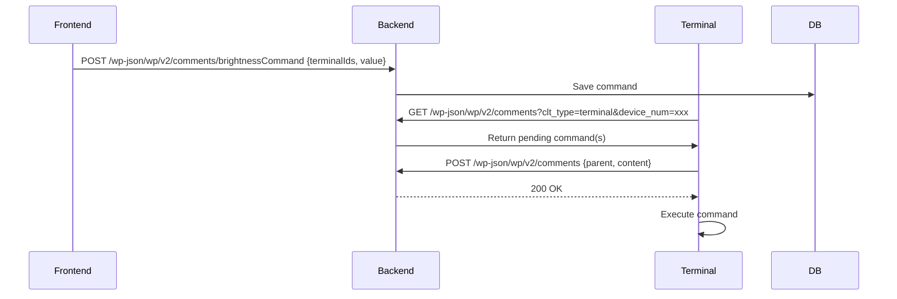

# HTTP Polling Command API

## 1. Frontend Command Dispatch

- **Endpoint**: `POST /wp-json/wp/v2/comments/{commandType}Command`
- **Request Body**:
  ```json
  {
    "terminalIds": [860, 861],
    "value": "66" // Only for commands that require value
  }
  ```
- **Backend Logic**:
  1. Controller parses the URL to determine the command type (e.g., brightnessCommand).
  2. Reads the body to get terminalIds and value.
  3. For each terminalId, creates a command record in the database (fields: type, karma, authorUrl, content/raw, etc. from CommandType enum and value).
  4. Returns 200 OK.

---

## 2. Terminal Polling for Commands

- **Endpoint**: `GET /wp-json/wp/v2/comments?clt_type=terminal&device_num=xxx`
- **Query Params**:
  - `clt_type=terminal` (fixed)
  - `device_num` = terminal serial number
- **Backend Logic**:
  1. Controller queries the database for pending commands for the given device_num (serialno).
  2. Returns an array of command objects (can return one or all, recommend one to avoid missed confirmations):
     ```json
     [
       {
         "id": 1,
         "post": 1,
         "author_url": "api/brightness",
         "content": { "raw": "{\"brightness\":88}" },
         "karma": 2
       }
     ]
     ```
  3. If no pending commands, returns an empty array.

---

## 3. Terminal Command Confirmation

- **Endpoint**: `POST /wp-json/wp/v2/comments`
- **Headers**: `Content-Type: application/json`
- **Params**: `post` (terminal id)
- **Body**:
  ```json
  {
    "parent": 999, // command id
    "content": "Executable comment" // or "Duplicate comments"
  }
  ```
- **Backend Logic**:
  1. Controller checks parent (command id) and post (terminal id).
  2. If not confirmed, marks as confirmed/executed, returns 200-300 status code.
  3. If already confirmed, returns "Duplicate comments" or 409/400 status code.

---

## 4. Terminal Executes Command
- Terminal executes the command only after receiving a 200-300 status code from the confirmation API.

---

## 5. Key Points
- **Command Generation**: Frontend only dispatches, backend assembles and stores command details using enum and value.
- **Command Distribution**: Terminal polls, backend returns pending commands for device_num.
- **Command Confirmation**: Terminal must confirm before execution, backend validates and marks as confirmed.
- **Command Uniqueness**: Each command has a unique id; terminal must use parent=id to confirm, preventing duplicate execution.

---

## 6. Sequence Diagram



---

## 7. Typical Command Response Example

```json
{
  "id": 1,
  "post": 1,
  "author_url": "api/brightness",
  "content": { "raw": "{\"brightness\":88}" },
  "karma": 2
}
```

---

## 8. Notes
- Frontend and terminal must strictly follow the agreed API format.
- Backend controller must parse URL, params, and body to determine command type and content, and store/distribute correctly.
- Confirmation mechanism must prevent duplicate execution. 